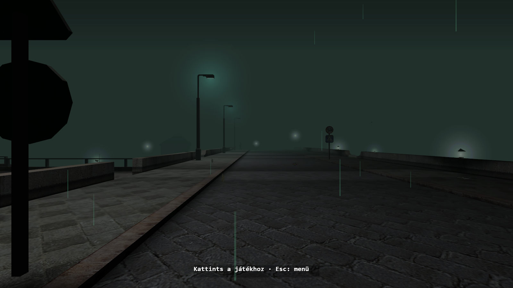
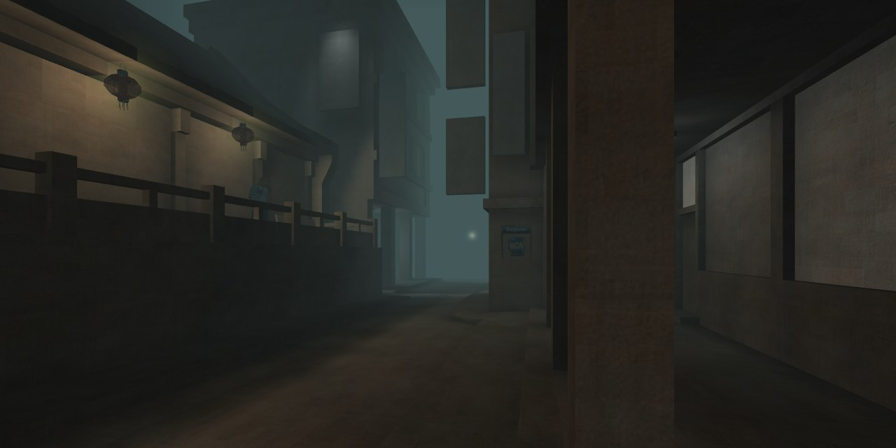

# A Mesterlövész: Újratöltve

A 2002-es **A Mesterlövész** (*Sniper: Path of Vengeance*, magyar 2.33-as kiadás) újraírása Rustban és Bevyben, az eredeti játékélményt követve.

**[Weboldal: sniper.gay](https://sniper.gay/)** · **[Kiskína: a kihagyott pálya](https://sniper.gay/kiskina.html)** · **[Képek és lejátszható hangok](https://sniper.gay/archive.html)**

## Mit tartalmaz?

- Az eredeti 27 kampánypálya betöltése és küldetésszkriptjei.
- Gyári szereplők, fegyverek, párbeszédek, feliratok, átvezetők, hangok és zene.
- Az eredeti menük, beállítások, mentés és töltés, gyorsmentés és gyorstöltés.
- Az eredeti pályafájlokból kinyert hálók, textúrák és lightmapek.
- A kampányból kihagyott **Kiskína** a **Bónusz** menüből indítható, külön mentéssel.
- A prológus esernyős emberének közösségi bohócarcos easter eggje a build része; régi exportból is automatikusan frissül.
- Dokumentált visszafejtés: a kiolvasott értékek, kódcímek, ellenőrzött és közelítő részek a [docs](docs/) mappában vannak.

A cél az eredeti működés 1:1-es reprodukálása. Ez a visszafejtett szabályokat követő Rust motor- és játékrendszer-újraírás; nem teljes, binárisan egyező C/C++ dekompiláció egyszerű átfordítása. A teljes képpontos és viselkedési azonosságot még nem igazoltuk. Az automata kampánybejárás eredményei a kutatási dokumentumokban olvashatók.

## Képek a játékból

**Frissítés (2026-10-08):** az ajtók és kis kapcsolók enyhe célzási eltéréssel is használhatók. A hatótáv és a falak ellenőrzése megmaradt. [A változás részletei](docs/interaction-update.md).

### Prológus — az éjszakai város



### Kiskína — a kampányból kihagyott pálya



## Indítás Windows 10/11-en — három lépés

**[Windows játékoscsomag letöltése (48 MB)](https://github.com/mesterlovesz/remake/releases/latest/download/Mesterlovesz-Ujratoltve-Windows.zip)**

1. **Csomagold ki a ZIP teljes tartalmát** egy írható mappába. Jobb kattintás → **Az összes kibontása**.
2. A [weboldal Játékfájlok gombjával](https://sniper.gay/#inditas) töltsd le az Archive.org magyar ISO-ját, és **tedd az Indit.bat mellé**.
3. **Dupla kattintás az Indit.bat-ra.** Első alkalommal az indító előkészíti az adatokat, majd megjelenik a főmenü.

```text
Mesterlovesz/
├── Indit.bat
├── A_mesterlovesz.iso
├── .player/
└── OLVASS-EL.txt
```

**Rustot, Pythont és az eredeti játék telepítőjét nem kell telepítened.** Az előre lefordított játék és a szükséges indítóeszközök a csomagban vannak. Rendszergazdai jog sem szükséges.

Kell hozzá **64 bites Windows 10/11, Vulkan-képes videokártya és 5 GB szabad hely**. Első alkalommal internet szükséges a médiafeldolgozó automatikus letöltéséhez (31 MB), és az előkészítés néhány perc. A későbbi indításokhoz internet sem kell. Az ISO az első sikeres előkészítés után eltávolítható. Az `output`, `GYARI` és `.player` mappák maradjanak az indító mellett.

Részletes játékos útmutató: [docs/PLAYER-hu.md](docs/PLAYER-hu.md).

### Fejlesztőknek: forrásból fordítás

A **Code → Download ZIP** a forrást tölti le. Ennek fordításához Rust MSVC, C++ Build Tools és Python szükséges; a külön lépések a [docs/SETUP-hu.md](docs/SETUP-hu.md) fájlban vannak. A játékoscsomag elkészítését a [packaging/README.md](packaging/README.md) írja le.

## Irányítás

| Gomb | Művelet |
|---|---|
| Egér, WASD | Körbenézés, mozgás |
| Shift, Ctrl | Futás, guggolás |
| Szóköz | Ugrás |
| Bal egér, R | Lövés, újratöltés |
| Jobb egér | Másodlagos fegyverfunkció |
| E | Használat, tárgyfelvétel, ajtó, beszélgetés |
| 1–8 | Fegyver elővétele |
| C, Z, X | Felszerelés, karakterinformáció, tulajdonságok |
| F5, F9 | Gyorsmentés, gyorstöltés |
| Esc | Játékmenü |

## Hibaelhárítás

- **ISO hiányzik**: tedd közvetlenül az `Indit.bat` mellé, és várd meg a letöltés végét.
- **Megszakadt az előkészítés**: indítsd újra az `Indit.bat`-ot; a kész lépések kimaradnak.
- **Nem tud letölteni**: az első alkalomhoz internet kell; ellenőrizd a kapcsolatot és indítsd újra.
- **Nem indul a megjelenítés**: frissítsd a videokártya-illesztőt; Vulkan-támogatás szükséges.
- **Naplók**: `inditas.log` és `output/.setup/logs/`. Hibajelentéshez a hiba szövegét és a megfelelő naplót add meg.

## Kiskína és a kutatási archívum

A Kiskína a gyári telepítésben megmaradt, de a fő kampány nem vezet hozzá. Az archívum 17 szereplőt, párbeszédszkripteket, beszédhangokat, útvonaladatokat és a pálya kijáratát mutatja be. Külön jelöljük a közvetlenül bizonyított tényeket, a következtetéseket és a nyitott kérdéseket. A „teljesen elveszett, soha be nem tölthető pálya” állítását nem kezeljük bizonyított tényként.

A [webes archívumban](https://sniper.gay/archive.html) a hangok egyenként lejátszhatók, a képek és a kutatáshoz válogatott fájlok elérhetők. A játék teljes telepített adatállományát és az ISO-t ez a tároló nem tartalmazza.

## A weboldal

A statikus weboldal és a Kiskína médiaarchívuma [külön tárolóban](https://github.com/mesterlovesz/mesterlovesz.github.io) van. A játék forrásának letöltéséhez ezek nem szükségesek. A webes publikálási workflow GitHub Pages-re tölti fel az oldalt, a megosztásokhoz Open Graph előnézeteket készít.

## Megjegyzés

Nem hivatalos rajongói projekt. Az eredeti játék és gyári anyagai a jogtulajdonosoké.

A projektet teljes egészében LLM-ek készítették. A projekt saját kódja nem tartalmaz ember által írt kódot.
